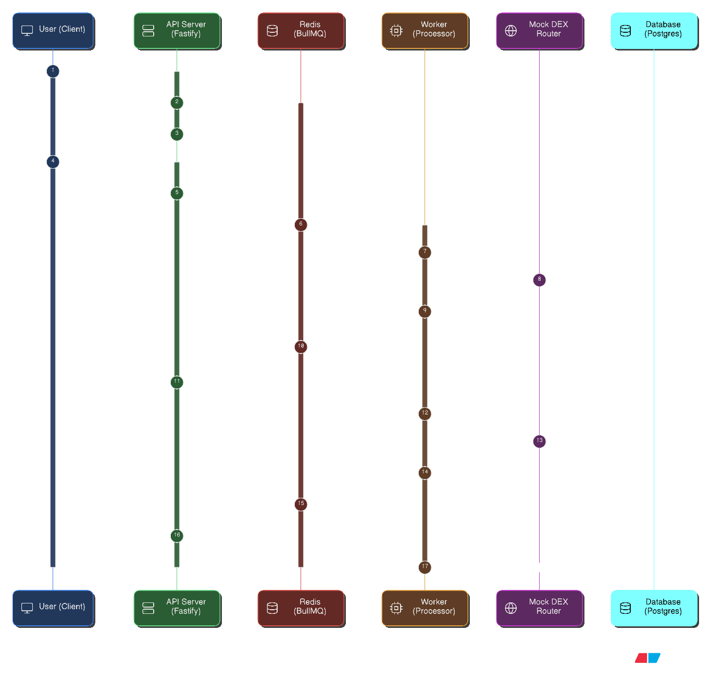

Here is a comprehensive, professional `README.md` file tailored to your project. It includes the architecture diagram you provided, technical details, and setup instructions to impress the reviewers.

**Action:** Save your sequence diagram image as `architecture.png` inside an `assets` folder in your repository (e.g., `assets/architecture.png`), or update the image link below to wherever you store it.

-----

# 🚀 Distributed Order Execution Engine

A high-performance, event-driven trading engine built with **Node.js** and **TypeScript**. This system simulates a smart DEX router that queries multiple liquidity sources (Raydium/Meteora), executes trades with concurrency controls, and streams real-time lifecycle updates to clients via WebSockets.

> **Goal:** Built to demonstrate a scalable **Producer-Consumer architecture** capable of handling high-throughput order processing with fault tolerance and exponential backoff strategies.

-----

## 🏗 System Architecture & Design

The system decouples high-throughput HTTP ingestion (API) from heavy background processing (Worker) using a Redis-backed message queue.



*Figure 1: End-to-End Sequence Diagram of the Order Execution Flow*

### Data Flow Breakdown

1.  **Ingestion:** Client submits a Market Order via HTTP. API validates inputs (Zod), persists an initial `PENDING` state to PostgreSQL, and pushes the job to **BullMQ**.
2.  **Queueing:** Redis manages the job queue, ensuring strict **FIFO** processing and enforcing a concurrency limit of **10 orders** to prevent rate-limiting downstream.
3.  **Processing:** The Worker service picks up the job:
      * Fetches live quotes from the **Mock DEX Router** (simulating network latency).
      * Compares prices between **Raydium** and **Meteora**.
      * Executes the trade on the venue with the best price.
4.  **Real-Time Feedback:** State changes (`ROUTING` -\> `CONFIRMED`) are published via **Redis Pub/Sub**.
5.  **Delivery:** The API Server (listening to Pub/Sub) forwards these events to the specific client's active **WebSocket** connection.

-----

## 🛠 Tech Stack

  * **Runtime:** Node.js v22 (TypeScript)
  * **API Framework:** Fastify (Chosen for low overhead and native async support)
  * **Message Broker:** Redis (BullMQ) for job queues & Pub/Sub
  * **Database:** PostgreSQL (Prisma ORM)
  * **Validation:** Zod
  * **Testing:** Jest (Unit & Integration tests with dependency injection)
  * **Infrastructure:** Docker & Docker Compose

-----

## ✨ Key Features

  * **Event-Driven Architecture:** Completely non-blocking API; heavy compute is offloaded to workers.
  * **Smart Routing:** Automatically selects the best execution price between multiple DEXs.
  * **Concurrency Control:** Limits active processing to **10 concurrent orders**.
  * **Fault Tolerance:** Implements **exponential backoff** retries (1s -\> 2s -\> 4s) for failed transactions before marking them as failed.
  * **Real-Time Updates:** WebSocket streaming of the full order lifecycle (Pending -\> Routing -\> Confirmed).
  * **Mock Simulation:** Realistic simulation of network latency (200ms-2s), price variance, and slippage errors.

-----

## 🚀 Quick Start

### Prerequisites

  * Docker & Docker Compose
  * Node.js v18+

### 1\. Start Infrastructure

Spin up PostgreSQL and Redis containers:

```bash
docker-compose up -d
```

### 2\. Install Dependencies

```bash
npm install
```

### 3\. Initialize Database

Run Prisma migrations to create the schema:

```bash
npx prisma migrate dev --name init
```

### 4\. Run the Engine

Start the API Server and the Worker process:

```bash
npm run dev
```

*Server will start at `http://localhost:3000`*

-----

## 📡 API Reference

### 1\. Submit Order (HTTP)

**POST** `/api/orders/execute`

**Request:**

```json
{
  "inputToken": "SOL",
  "outputToken": "USDC",
  "amount": 10.5
}
```

**Response (201 Created):**

```json
{
  "message": "Order received",
  "orderId": "550e8400-e29b-41d4-a716-446655440000",
  "status": "pending"
}
```

### 2\. Live Updates (WebSocket)

**URL:** `ws://localhost:3000/ws?orderId={orderId}`

Connect immediately after receiving the `orderId`. You will receive a stream of JSON events:

1.  `PENDING`: Order accepted.
2.  `ROUTING`: Quotes fetched, best DEX selected (includes price data).
3.  `CONFIRMED`: Trade executed successfully (includes `txHash`).
4.  `FAILED`: Execution failed after 3 retry attempts.

-----

## 🧪 Testing

The project includes a comprehensive test suite using **Jest**.

  * **Unit Tests:** Validate the Mock Router logic (variance, delays).
  * **Integration Tests:** Validate the API flow using mocked Queue and Database dependencies.

<!-- end list -->

```bash
npm test
```

-----

## 🧠 Design Decisions

  * **Why Market Orders?** I chose to focus on the architectural challenge of latency and concurrency management rather than complex order-book matching logic. This allowed me to demonstrate a robust queue system suitable for high-frequency trading environments.
  * **Why BullMQ?** Native support for exponential backoff and concurrency management made it superior to building a custom `setInterval` loop or simple array-based queues.
  * **Why Fastify?** Its low overhead and built-in WebSocket support provided a cleaner, faster implementation than Express.js for this real-time use case.